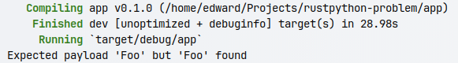
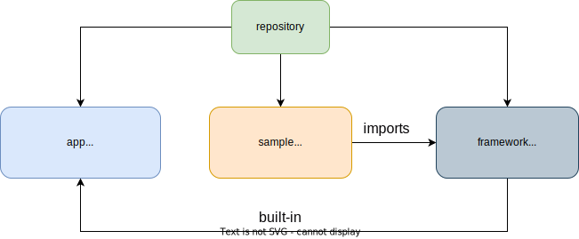
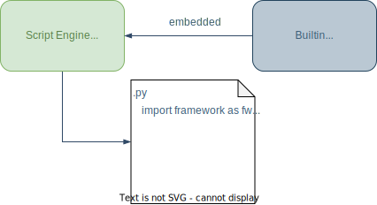

# Problem
This repository contains code that demonstrates the problem of accessing class fields from custom built-in module.
When `foo.name` accessed (by getter or setter) the `Expected payload 'Foo' but 'Foo' found` error displays. 

```py
# sample/main.py

from framework import foo

f = foo.Foo()
f.name = "Bar" # <-- PROBLEM IS HERE: Expected payload 'Foo' but 'Foo' found
```


```rust
// rust implementation

#[pyattr]
#[pyclass(name = "Foo")]
#[derive(Debug, PyPayload)]
struct Foo {
    name: PyMutex<String>,
}

#[pyclass]
impl Foo {
    #[pygetset]
    fn name(&self) -> PyStr {
        PyStr::from(self.name.lock().as_str())
    }

    #[pygetset(setter)]
    pub fn set_name(&self, value: PySetterValue<PyStrRef>, _: &VirtualMachine) {
        let mut n = self.name.lock();
        *n = value.unwrap().as_str().to_string();
    }

}
```

See ['Foo'](framework/src/foo.rs) source details. 

**What am I doing wrong ?**

## Stack 
- rust
- rustpython 0.3.1
- rustpython-vm 0.3.1

## Project scheme


Use command bellow to run the demo
```bash
cargo run --bin app
```

## Why this problem is critical for me ?
I need to create a scripting engine that integrates the Python interpreter
and provides a framework that can be used in scripts. I want to implement
the framework entirely in Rust.


